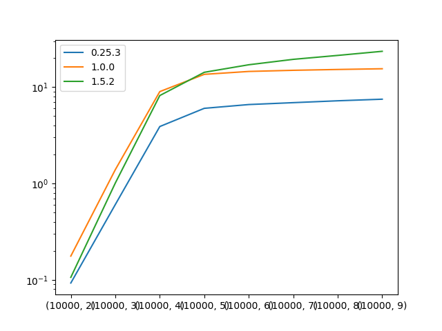

# Performance degradation for recent versions of pandas

# A simple function

```python
def func(x: pd.DataFrame) -> pd.DataFrame:
    # doing some stuff
    return x.copy()


def test() -> None:
    keys = data.columns.tolist()
    result = (
        data
        .groupby(keys, group_keys=True)
        .apply(func)
    )
    return result
```

# Install and run

Tested on python 3.8.15 

```bash
make run VERSION=0.25.3
make run VERSION=1.0.0
# by default pandas version 1.5.2
make run 
```

# Performance degradation for recent versions



| Version | Performance | Performance degradation |
|---------|-------------|-------------------------|
| 0.25.3  | 7.5 s       | 1.00x                   |
| 1.0.0   | 15.5 s      | 0.50x                   |
| 1.5.2   | 23.5 s      | 0.32x                   |

See results.csv file for details
